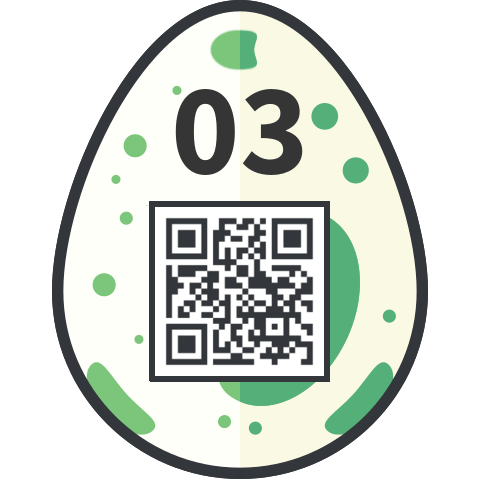

# 03 - Pony Coder

> Tony the pony has encoded something for you. Decode his message and enter it
> in the egg-o-matic below! **Lowercase and spaces only, and special characters!**
> 
> ```
> gn tn-gha87be4e
> ```

The curious format of the message, the fact that "special characters"
are explicitly mentioned in the description, and finally the title, 
all leads us towards [Punycode](https://en.wikipedia.org/wiki/Punycode).

Nodejs (version < 7, or via [punycode.js](https://github.com/bestiejs/punycode.js/)) has support for punycode, so let's try it out:

```js
$ node
> let punycode = require('punycode');
undefined
> punycode.decode('gn tn-gha87be4e')
'gìn tônì©'
```

Altough the desription says it allows special characters, pasting 
`gìn tônì©` directly does not open the egg. However, `"gin tonic"`
does, and we get the following egg:


