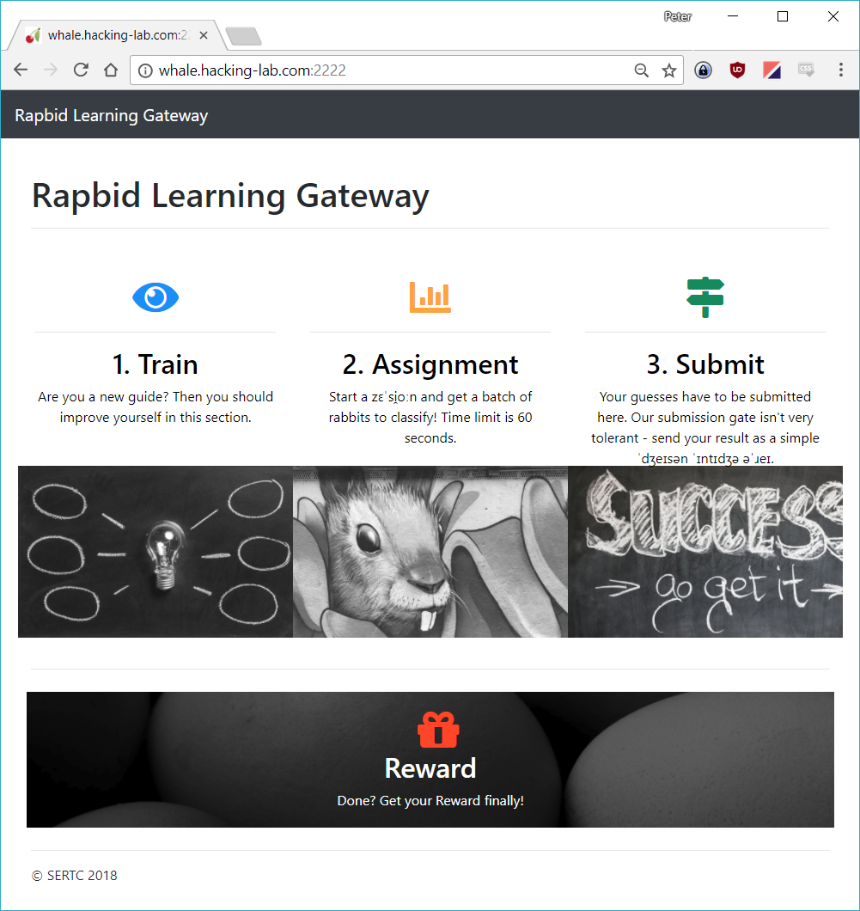

# 23 - Rapbid Learning

> The SERTC (super exciting rabbit travel company) wants to use the latest technology.
> 
> They currently employ an experienced guide, which is classifying the visitors into Goodtails
> and Luckyspoons. For the trained eye of the guide, this is easy. But how do you get a machine
> to do it (which would be cheaper)?
> 
> Go and help them implement a learning algorithm! Their platform is available here:
> 
> `http://whale.hacking-lab.com:2222`
> Since quality is the main concern of SERTC, they expect an accuracy of at least 99%.

## Challenge Overview

The Rapbid Learning Gateway website has four links. *Train*, *Assignment*, *Submit*, and finally a *Reward*:



### Train

> Are you a new guide? Then you should improve yourself in this section.

The Train (`/train`) endpoint returns properties for a single rabbit, and if this rabbit is good (`g00d`) or not:
```json
{"sp00n": 7, "n4m3": "Sadie", "t41l": 9, "w31ght": 4, "c0l0r": "blue", "ag3": 0, "l3ngth": 41, "g00d": true, "g3nd3r": "female"}
```

This endpoint is used to train a model on predicting `g00d` based on the other properties.

### Assignment

> Start a zɛˈsi̯oːn and get a batch of rabbits to classify! Time limit is 60 seconds.

The Assignment (`/gate`) link returns a JSON blob with a bunch of rabbits, but without the `g00d` property:

```json
{"attributes": ["bjRtMw==", "ZzNuZDNy", "NGcz", "YzBsMHI=", "dzMxZ2h0", "bDNuZ3Ro", "c3AwMG4=", "dDQxbA=="], "data": [["Antonio", "male", 4, "red", 2, 46, 14, 11], ["Maria", "female", 1, "white", 5, 43, 10, 10], ...]
```

This endpoint returns the rabbits that we should predict the `g00d` property for. 

Note also that this endpoint does some minor obfuscation of the `"attributes"`. They are both base64-encoded, and then sometimes slightly altered (e.g. `4g3` instead of `ag3`). We will have to handle this when fetching the data.

### Submit

> Your guesses have to be submitted here. Our submission gate isn't very tolerant - send your result as a simple ˈdʒeɪsən ˈɪntɪdʒə əˈɹeɪ.


The Submit link (`/predict`) returns a `405 - Method Not Allowed` if visited directly from a browser. This is reasonable as this is likely the endpoint that we should send our prediction to.

As the description says (after some interpretation) the endpoint expects a json integer array, ordered so that each integer represents whether the rabbit at this position in the `Assignment` data is `g00d` (`=1`) or not (`=0`).

### Reward

Finally, the reward link is fairly self-explanatory. If we manage to do a successful prediction this should be where we get our egg. Visiting the link without the correct prediction we get the following message:

> Unvalid cookies aren't traded for rewards!


## Implementation

### Dependencies:
We are using a couple of third party libraries for this challenge, use [pipenv](https://pipenv.org) to install them:

```
$ pipenv install
$ pipenv shell
```


### Step 1. Downloading and formatting data

Since this looks to be a machine learning problem, the first thing we do is start downloading data. The [dl_train_data.py](dl_train_data.py) script does just that. It uses the `requests` library to fetch a rabbit from the `/train` URL and store it in a local file.

After having downloaded a fair number of rabbits (around 20k - probably a bit on the higher end), we want to format the data such that it is easily imported into `tensorflow`. The [TensorFlow Linear Model Tutorial](https://www.tensorflow.org/tutorials/wide), which we will come back to, uses data formatted as CSV so we will do that too.

The [format_train_data.py](format_train_data.py) reads the data downloaded and outputs it as CSV. `format_train_data.py` also splits the data set into two, one training set ([data_train.csv](data_train.csv)) and a validation set ([data_test.csv](data_test.csv)). We do this split so that we have something to validate our trained model against to get an idea how well it will perform against unknown data later.

```
$ python dl_train_data.py
$ python format_train_data.py
```


### Step 2. Training a model

After downloading the data we now want to train a model on predicting the `g00d` property given all the other properties. To do so we use TensorFlow to create a linear logistic model, following closely to the [TensorFlow Linear Model Tutorial](https://www.tensorflow.org/tutorials/wide).

The [train.py](train.py) script is very similar to the [wide_deep.py](https://github.com/tensorflow/models/blob/master/official/wide_deep/wide_deep.py) from the TensorFlow tutorial, but with all options hardcoded to default values and (obviously) changes to the column names and default values. As a first step (which turned out to be enough) a `LinearClassifier` was used, with each column in the data represented by one feature column.

The model fairly quickly ended up at an accuracy of `1.0`, which seems somewhat practise   but likely indicates(?) that the rabbit data is generated by a linear model that our model can then learn to predict.

```
$ python train.py
```


### Step 3. Prediction

The third and final step is fairly straight forward, at least in theory:
1. Hit the Assignment endpoint and download the data to predict
2. Run the pre-trained model on the data to get a prediction for `g00d` for each rabbit
3. Submit the predictions to the Submit endpoint
4. Get the egg (?) from the reward URL

In practice there were two things that made this take a bit longer time to implement. First, "deobfuscating" the attributes names, and secondly, getting `requests` to play nice with the `session_id` cookie.

The deobfuscation was implemented by first base64 decoding each attribute name (`NGcz` -> `4g3`), then using [`difflib.SequenceMatcher`](https://docs.python.org/3.6/library/difflib.html) to match the attribute to the closest known attribute (`4g3` -> `ag3`). The second step was required as, like previously mentioned, some attributes were returned slightly altered compared to the attribute names used for the training data.

The fact that a `session_id` was required was found out during some initial testing of the endpoints. It seems like the `session_id` cookie is used to "connect" requests between the endpoints, so that the server knows what predictions are correct. Cookies should be transparently handled when using `requests.Session`s, but some requests failed to include the appropriate cookie. The solution was to explicitly include the `session_id` from the `requests.Session` object like in the snippet below. Exactly why this had to be done remains a mystery...

```py
cookies = {"session_id": session.cookies["session_id"]}
return session.post(REWARD_URL, cookies=cookies).text
```

With those two roadblocks out of the way, implementing the [predict.py](predict.py) script was fairly straight forward. The final script follows the steps in the list at the beginning of this section.

Finally, running `python predict.py` (and doing some manual parsing of the output) we find that we managed to predict the `g00d` value with an accuracy of `99.98%`. Not bad! As expected, the reward is the egg for the level:


